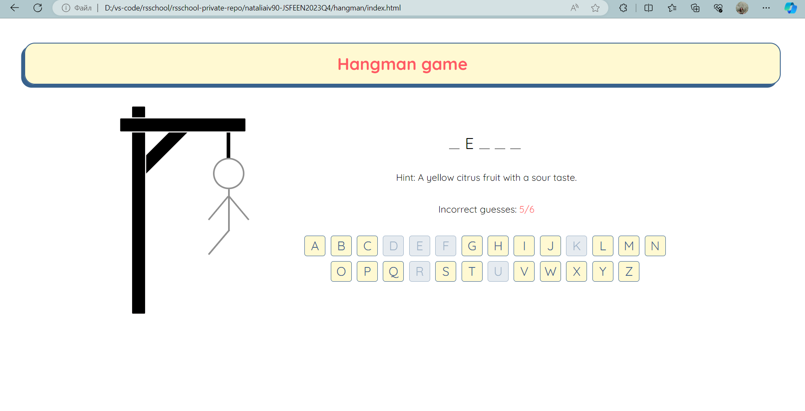
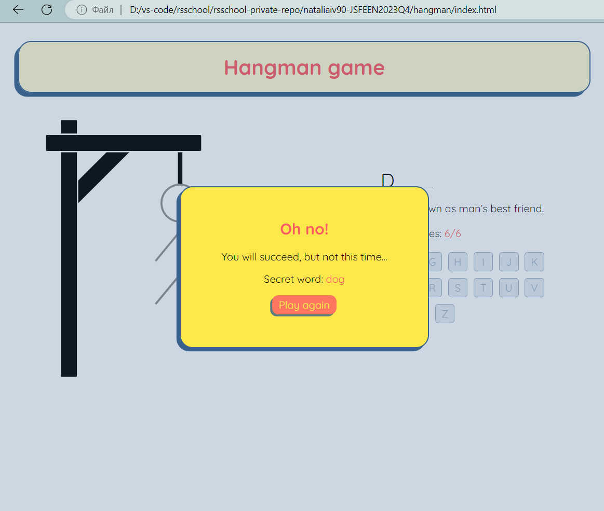

# HANGMAN project

Deploy: [link](https://nataliaiv90.github.io/hangman/)

Done 25.01.2024
 
## Task: [task](https://github.com/rolling-scopes-school/js-fe-course-en/blob/main/tasks/hangman/hangman.md)

[Hangman](https://en.wikipedia.org/wiki/Hangman_(game)) is a classic word game in which you must find the correct answer by guessing letters one at a time.

### Game rules

The game is represented by two main parts: the gallows part and the quiz part.

At the beginning of the game, the gallows is empty.

The quiz part includes:
+ a question,
+ a secret word (the answer to the question), represented by underscores for each letter in the word (for example, if the secret word is 'address' it will be written like '_ _ _ _ _ _ _'),
+ an incorrect guesses counter,
+ a virtual keyboard,

The user must be able to use both virtual (by clicking letter keys on the screen) and physical keyboards (by pressing letter keys on their keyboard) to play the game.

When the user starts guessing the letters:
+ whenever the letter is guessed correctly, this letter appears instead of the corresponding underscore(s) (for the example mentioned above, if the user clicks or presses the 'd' letter, both 'd's must appear on the screen: '_ d d _ _ _ _');
+ if the letter is not in the word, one body part must be added to the gallows and the incorrect guesses counter must be updated accordingly;
+ the clicked/pressed letter must be disabled and it must be reflected in the UI (for example, by using a different color on the disabled button);

The body parts appear on the gallows in the following order: head, body, left arm, right arm, left leg, right leg. It means that the user has 6 attempts to guess the word.

The player will continue guessing letters until either the word is solved or all six body parts are on the gallows.

At the end of the game, a modal window must appear. It must:
+ include the message that either congratulates the user on winning the game or informs them that they failed to win;
+ the secret word (even if it was guessed correctly);
+ a "play again" button.

When the user clicks on "play again", the game starts over:
+ the gallows is empty;
+ the question is changed;
+ the underscores are updated according to the new secret word (the same secret word can't be used as an answer to more than one question);
+ an incorrect guesses counter is set to 0.

## Screenshots:

## Requirements

+ Responsive/adaptive UI from 1440px to 360px viewport.
+ The generation of DOM elements is implemented. body in the index.html is empty (can contain only script tag). This requirement can be checked by pressing Ctrl+U (Windows) or Option(⌥)+Command(⌘)+U (Mac)
+ The game starts with the correct default view (empty gallows, underscores for secret word, etc.) and a random question.
+ The user can play the game by using the virtual keyboard.
+ The user can play the game by using the physical keyboard.
+ When the letter is correct, it appears instead of the corresponding underscore. If the letter repeats in the word, all corresponding underscores must be replaced by it.
+ When the letter is incorrect: the incorrect guesses counter is updated, a body part is added to the gallows.
+ The clicked/pressed letter is disabled.
+ The body parts appear on the gallows in the logical order (head, body, left arm, right arm, left leg, right leg).When the user runs + out of 6 attempts or wins the game, the modal window appears.
+ The modal window includes the message about the game's outcome+  (winning or losing), the secret word and the 'play again' button.
+ When the user clicks the 'play again' button, the game starts over by showing a new question and resetting the gallows, the incorrect guesses counter and the underscores for the secret word.
